---
Tarea realizada por Jose Ramón López Marrón
---

# Ejercicio - almacenamiento

### Ejercicio 1

Crea una carpeta llamada `saludo` y dentro de ella crea un fichero llamado `index.html` con el siguiente contenido (Deberás sustituir ese XXXXXx por tu nombre.):

```bash
mkdir saludo
cd saludo
echo "<h1>Hola soy Jose Ramón</h1>" > index.html
```

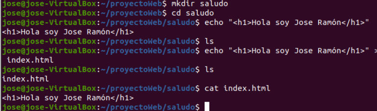

### Ejercicio 2

 Una vez hecho esto arrancar dos contenedores basados en la imagen php:7.4- apache que hagan un bind mount de la carpeta `saludo` en la carpeta `/var/www/html` del contenedor. Uno de ellos vamos a acceder con el puerto 8181 y el otro con el 8282. Y su nombres serán `c1` y `c2` .

```bash
docker run -it --rm --name my-running-script -v "$PWD":/usr/src/myapp -w /usr/src/myapp php:7.4-apache php your-script.php
docker run -d --name c1 -p 8181:80 --mount type=bind,src=/home/jose/proyectoWeb/saludo,dst=/var/www/html/ php:7.4-apache
docker run -d --name c2 -p 8282:80 --mount type=bind,src=/home/jose/proyectoWeb/saludo,dst=/var/www/html/ php:7.4-apache
curl http://localhost:8181
```

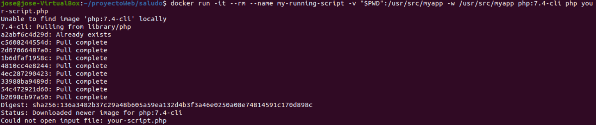

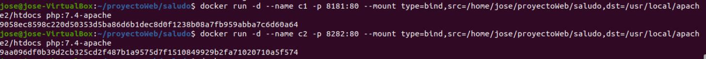

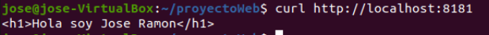

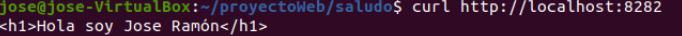

### Ejercicio 3

Modifica el contenido del fichero `~/saludo/index.html` .

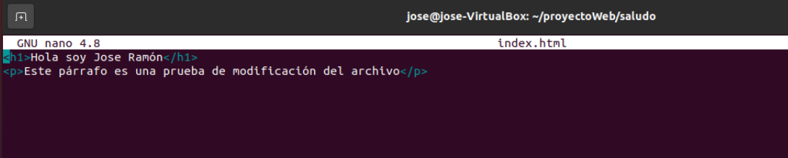

### Ejercicio 4

Comprueba que puedes seguir accediendo a los contenedores, sin necesidad de reiniciarlos.

```bash
sudo nano index.html
curl http://localhost:8181
curl http://localhost:8282
```

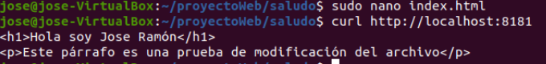

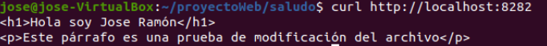

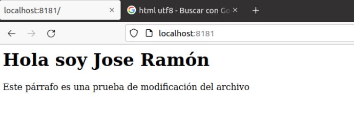

### Ejercicio 5

Borra los contenedores utilizados.

```bash
docker rm -f $(docker ps -aq)
docker ps -a
```

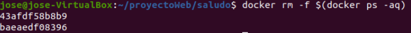

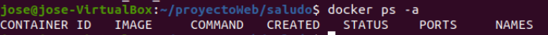
